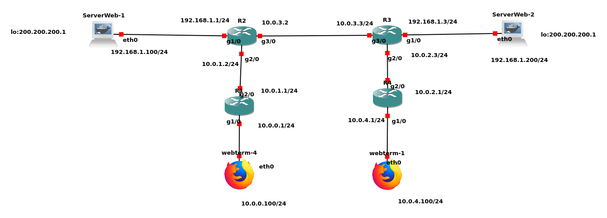
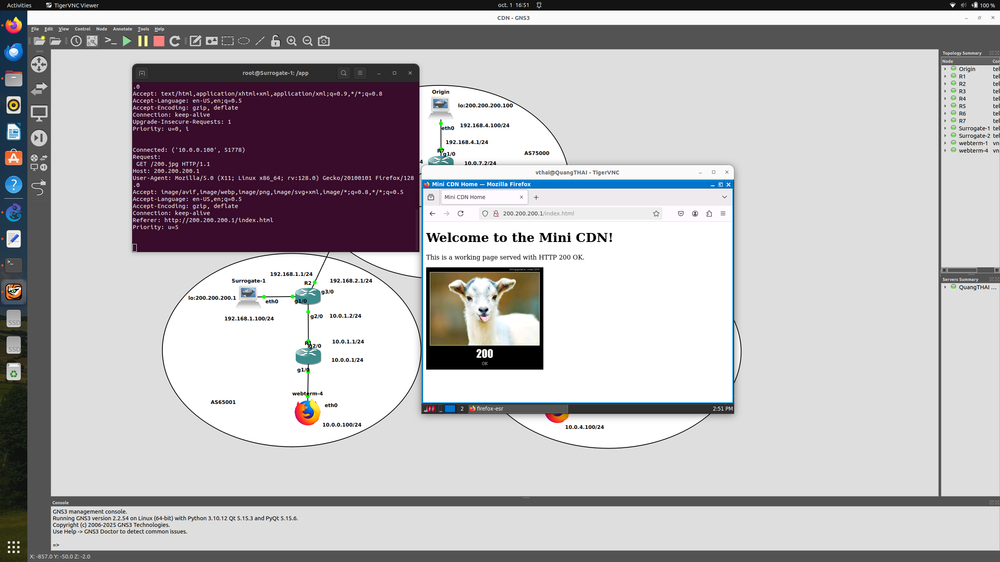
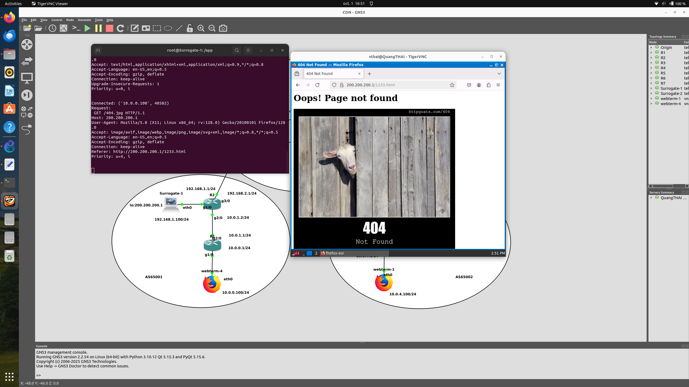

# 5tc-cdn-project
A Content Delivery Networks (CDN) project by Van Quang Thai, Sofia El Khalifi, Léna Voinchet et Augusto Moraes.

## Phase 0 : Mickey
For this phase we designed a web server that
- answers to GET requests for files stored locally ✅
- answers `Error 404` otherwise ✅

The web architecture designed for this phase can be found bellow :

## Phase 1 : Minnie 
A web server that :
- answers to get request for files stored locally ✅
- returns a defaut image otherwise ✅

When request the file stored locally  

In case, the file is not there locally return a funny image 

## Phase 2 : Donald
When files are not stored locally
- Get file from a central server ✅
- Apply a caching strategy : we apply least recently used ✅
- Deliver it ✅

## Phase 3 :  Pluto
When files are not stored locally
- Apply a strategy to know where to get the file
- Obtain the file

## Phase 4: Huey, Dewey, Louie
A web server
- Obtain your files using an IP interface different than
the one over which you receive your eyeball queries
- (Necessary for a proper anycast based CDN)

